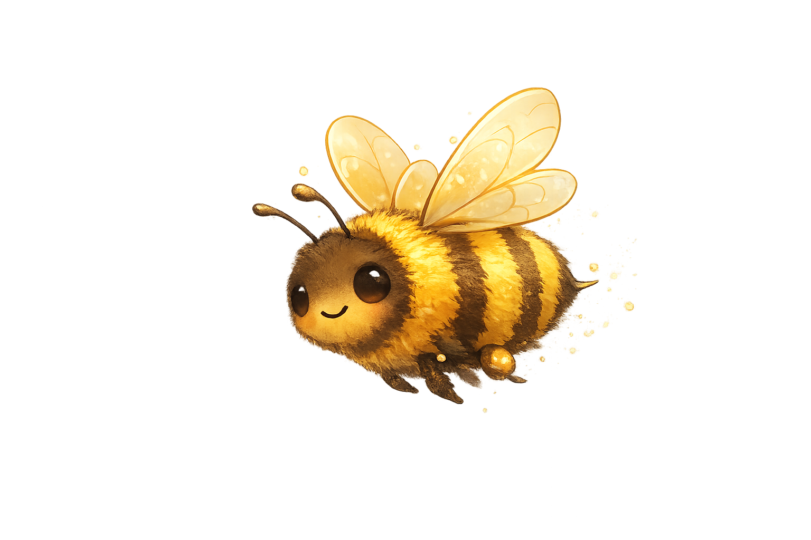

# Buzzword



Buzzword is a multiplayer party game about social alignment. Players answer open-ended prompts and score by matching others. Drift too far from the group and you're out.

## Status

MVP in progress. Single-instance, in-memory game state.

## Tech Stack

- Next.js (App Router)
- React
- Server Actions + polling for game state
- Tailwind CSS
- CamelidCoin

## Getting Started

```bash
npm install
npm run dev
```

Open http://localhost:3000

## Environment

Copy `.env.example` to `.env` and set:

- `CAMELIDCOIN_API_KEY`
- `CAMELIDCOIN_URL`
- `CAMELIDCOIN_MODEL`

## Project Structure

```
app/             UI + API routes
lib/game/        Core game logic
lib/llm/         LLM helpers
public/          Static assets
```

## Notes

- Room state is stored in-memory for MVP.
- Server Actions are used for create/join/submit flows.
- `/api/game/[id]` is used for polling game state.

## MVP and Bee-yond

- Redis to stop storing game state in memory. Allows serverless, minimal volatility, better scalability
- Improve security, game assumes non malicious actors right now. Multiple security features are needed at scale. 
